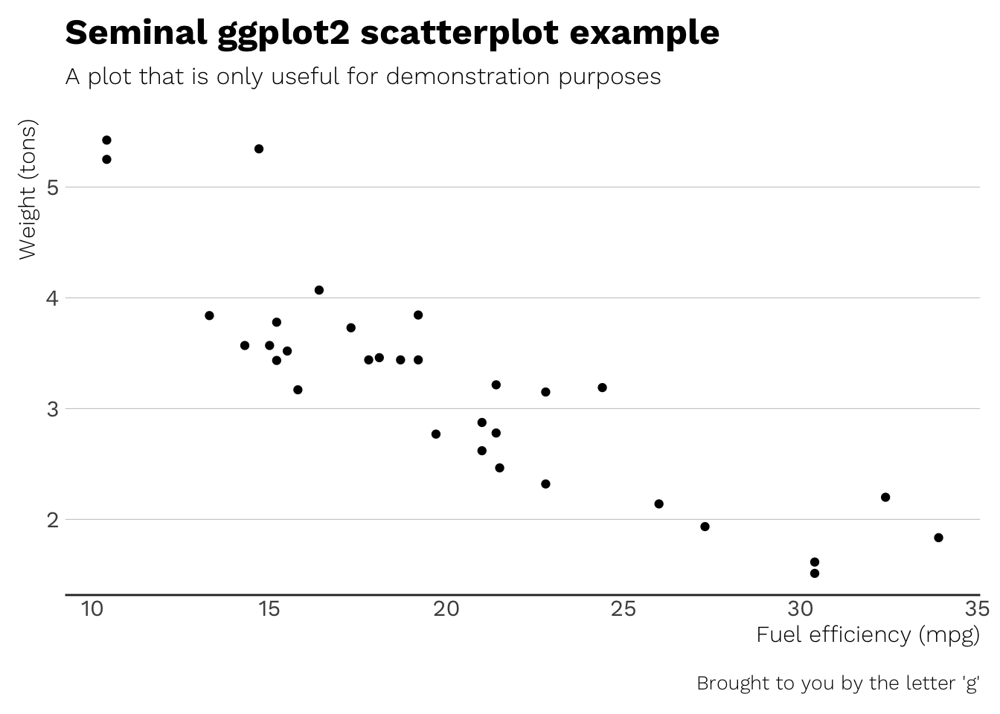

## ewenthemes: Beautiful Themes and Theme Components for ‘ggplot2’

[](http://www.repostatus.org/#active)
[](https://travis-ci.org/ewenme/ewenthemes)

-----

Typography-centric themes and theme components for ggplot2, standing on
the shoulders of [hrbrthemes](https://github.com/hrbrmstr/hrbrthemes).

The core theme, `theme_ewen`, uses Arial Narrow which should be
installed on practically any modern system. The theme variations use
widely available typefaces - [Work
Sans](https://github.com/weiweihuanghuang/Work-Sans) by Wei Huang, and
[Spectral](https://fonts.google.com/specimen/Spectral) by Production
Type.

The following functions are implemented/objects are exported:

Core themes:

  - `theme_ewen`: Arial Narrow-based theme
  - `theme_ewen_ws`: Work Sans-based theme
  - `theme_ewen_sp`: Spectral-based theme

The following global variables are now in your namespace:

  - `font_an`: a short global alias for “`Arial Narrow`”
  - `font_ws`: a short global alias for “`Work Sans`”
  - `font_ws_light`: a short global alias for “`Work Sans Light`”
  - `font_ws_extra_light`: a short global alias for “`Work Sans
    ExtraLight`”
  - `font_ws_bold`: a short global alias for “`Work Sans Bold`”
  - `font_sp`: a short global alias for “`Spectral`”
  - `font_sp_light`: a short global alias for “`Spectral Light`”
  - `font_sp_bold`: a short global alias for “`Spectral Bold`”

### Installation

``` r
devtools::install_github("ewenme/ewenthemes")
```

### Usage

``` r
library(ewenthemes)
library(ggplot2)
library(ghibli)

# current verison
packageVersion("ewenthemes")
## [1] '1.0.0'
```

### Base theme (Arial Narrow)

``` r
ggplot(mtcars, aes(mpg, wt)) +
  geom_point() +
  labs(x="Fuel efficiency (mpg)", y="Weight (tons)",
       title="Seminal ggplot2 scatterplot example",
       subtitle="A plot that is only useful for demonstration purposes",
       caption="Brought to you by the letter 'g'") + 
  theme_ewen()
```


### Work Sans

``` r
ggplot(mtcars, aes(mpg, wt)) +
  geom_point(colour = ghibli_palette(name = "SpiritedMedium")[4]) +
  labs(x="Fuel efficiency (mpg)", y="Weight (tons)",
       title="Seminal ggplot2 scatterplot example",
       subtitle="A plot that is only useful for demonstration purposes",
       caption="Brought to you by the letter 'g'") + 
  theme_ewen_ws()
```



### Code of Conduct

Please note that this project is released with a [Contributor Code of
Conduct](CONDUCT.md). By participating in this project you agree to
abide by its terms.
