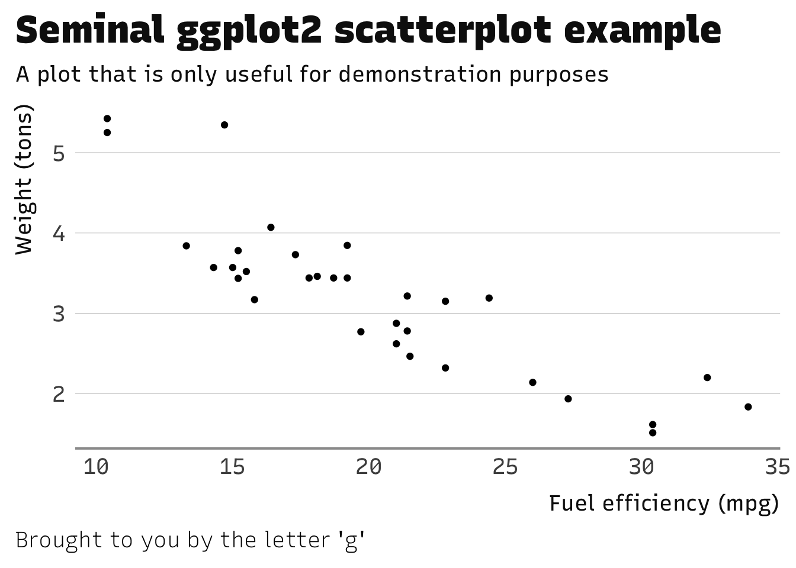
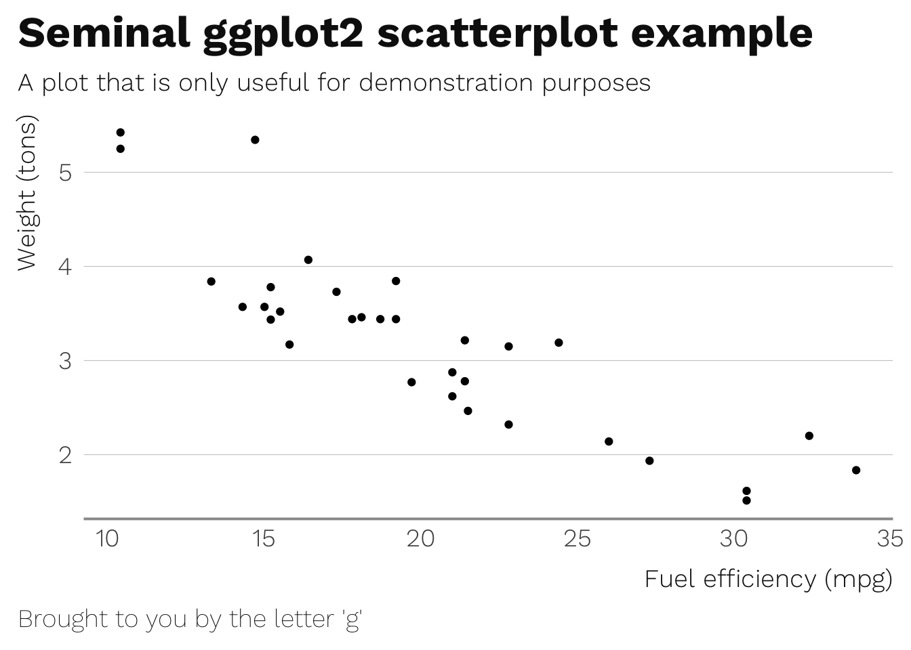

## ewenthemes

[](https://www.tidyverse.org/lifecycle/#maturing)
[](http://www.r-pkg.org/pkg/ewenthemes)
[](https://travis-ci.org/ewenme/ewenthemes)

Minimal, typography-centric themes and aesthetic helpers, principally
for charts on [ewen.io](https://ewen.io). Standing on the shoulders of
[hrbrthemes](https://github.com/hrbrmstr/hrbrthemes).

The core theme, `theme_ewen()`, uses Arial Narrow, which should be
installed on practically any modern system. Variations on this theme
implement custom typefaces - `theme_ewen_rs` uses the [Recursive
typography palette](https://www.recursive.design/), `theme_ewen_ws()`
runs on Wei Huang’s [Work
Sans](https://github.com/weiweihuanghuang/Work-Sans).

Core themes:

  - `theme_ewen`: Arial Narrow-based theme
  - `theme_ewen_rs`: Recursive Sans-based theme
  - `theme_ewen_ws`: Work Sans-based theme

### Installation

``` r
devtools::install_github("ewenme/ewenthemes")
```

### Usage

``` r
library(ewenthemes)
library(ggplot2)
```

### Base theme + Recursive Sans

``` r
ggplot(mtcars, aes(mpg, wt)) +
  geom_point() +
  labs(x="Fuel efficiency (mpg)", y="Weight (tons)",
       title="Seminal ggplot2 scatterplot example",
       subtitle="A plot that is only useful for demonstration purposes",
       caption="Brought to you by the letter 'g'") + 
  # apply theme
  theme_ewen_rs()
```



### Base theme + Work Sans

``` r
ggplot(mtcars, aes(mpg, wt)) +
  geom_point() +
  labs(x="Fuel efficiency (mpg)", y="Weight (tons)",
       title="Seminal ggplot2 scatterplot example",
       subtitle="A plot that is only useful for demonstration purposes",
       caption="Brought to you by the letter 'g'") + 
  # apply theme
  theme_ewen_ws()
```


